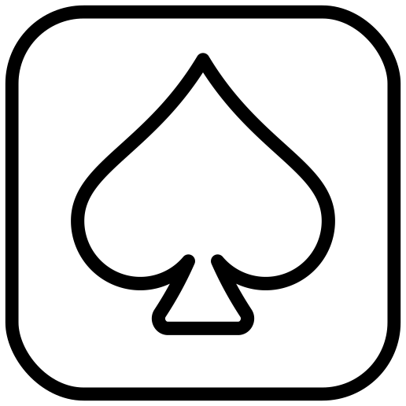

### *a deck of cards*
## clean and simple card games for mobile and browser 
Demo: [deckofcards.vercel.app](https://deckofcards.vercel.app/)
 A deck of cards is a web-based classic card game suite built with Next.js, React, and Tailwind CSS. It is designed with a clean, high-contrast aesthetic that is specifically optimized for e-ink displays. Google Firebase used to develop. No trackers, no database, no ads, just a deck of cards to play games with on your phone.

- [Core Features](#core-features)
- [Screenshots](#screenshots)
- [Style Guide](#style-guide)
- [To-Do List](#to-do-list)
  - [Bugs](#bugs)
  - [Future Features](#future-features)

## Core Features
- **Multiple Games:** Play classic Klondike Solitaire, Freecell, and Spider.
- **Customizable Rules:**
    - Spider: Play with 1, 2, or 4 suits for varying difficulty.
    - Solitaire: Play one card or three card draw.
- **Modern & Responsive UI:** A clean, high-contrast interface that works on all screen sizes, from mobile to desktop.
- **Customized Views:** App includes a light and dark mode, color mode (full color or greyscale), and the option to display the tableau left-hand oriented or right-hand oriented. These options can be changed at any time and will not end the game. 
- **Intuitive Controls:**
    - **Drag & Drop:** Move cards by dragging them to valid piles.
    - **Click to Move:** Enable this mode in settings to automatically move cards to a valid destination with a single click.
    - **Keyboard Shortcuts:** Use `Enter` to draw, `Ctrl/Cmd+Z` to undo, `Ctrl/Cmd+N` for a new game, and more.
    - **Swipe Gestures:** On touch devices, swipe right to undo your last move.
- **Game Statistics:** Tracks wins, best scores, and best times for each game.
- **Persistent Settings:** Your preferred game type, scores, and settings are saved locally in your browser for your next visit. This app functions fully offline.
- **Progressive Web App (PWA):** Installable on your mobile device for a native-like experience.

## Style Guide
### Title Font: Lazarus Oz Syndfri
A playful, handwritten-style font for the main game title, giving the app a unique and friendly personality.

### Body Font: Google Sans Code
A clean, monospaced font used for all UI text, ensuring excellent readability and a modern, technical feel.

### Icons: [Lucida](https://lucide.dev/)
Specific icons atypical to UI conventions used because damnit I need at least a *little* bit of whimsy in an app

## Screenshots
### Browser
 
 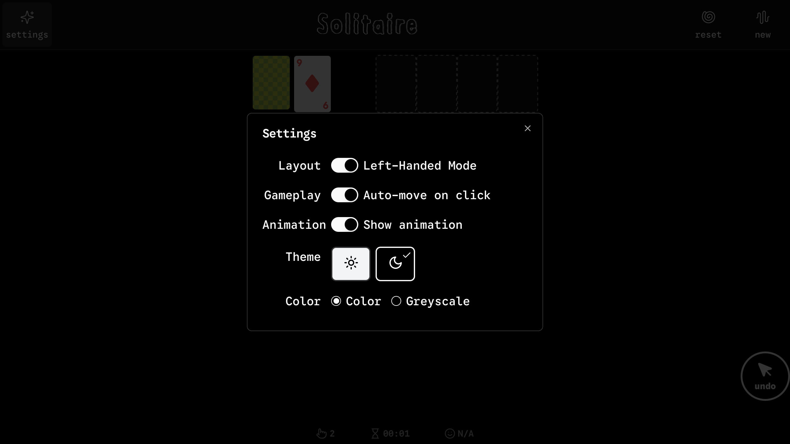
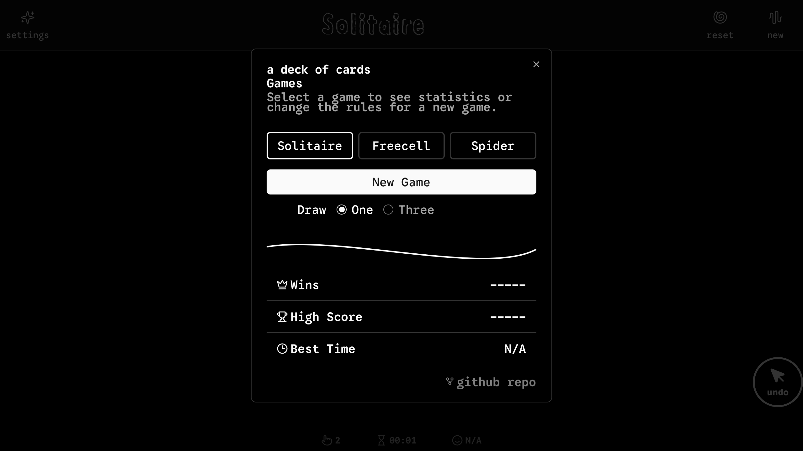
 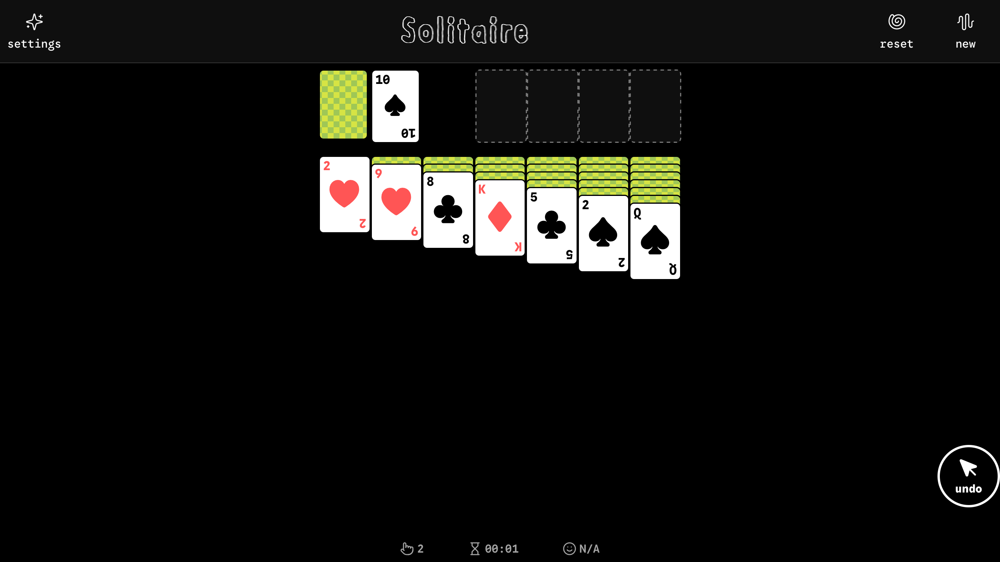

### Mobile
#### Light mode
 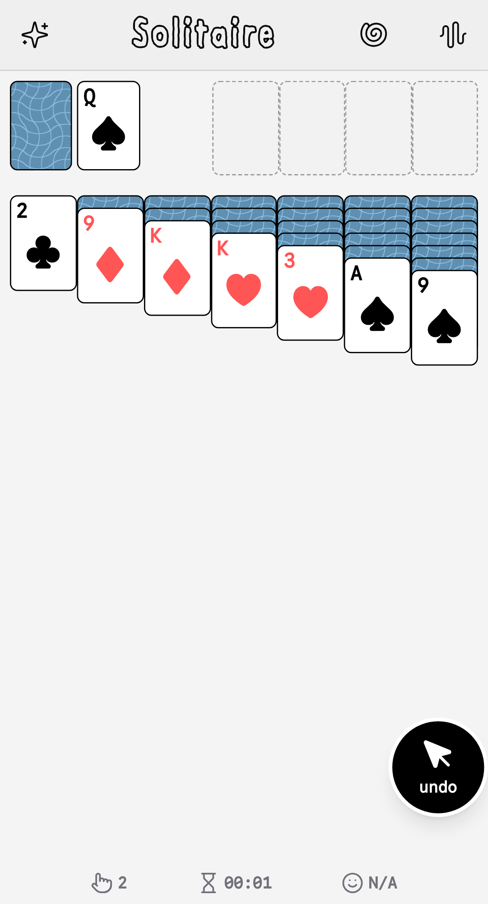
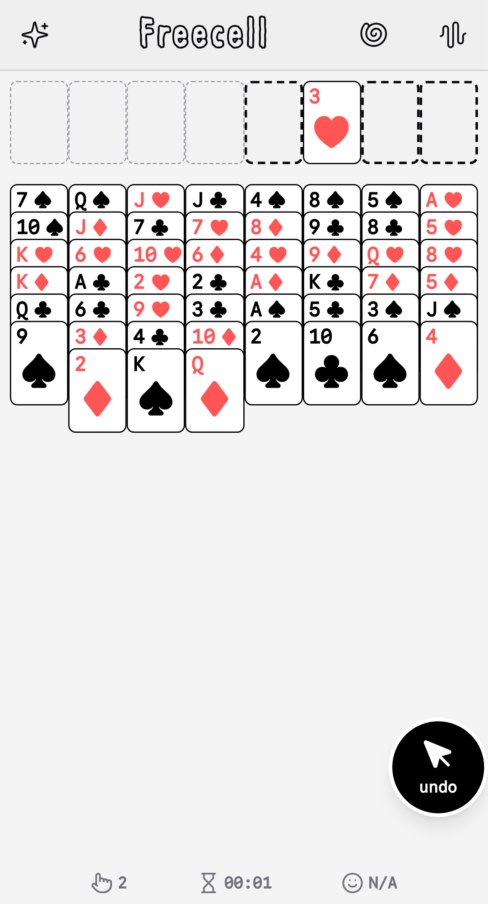
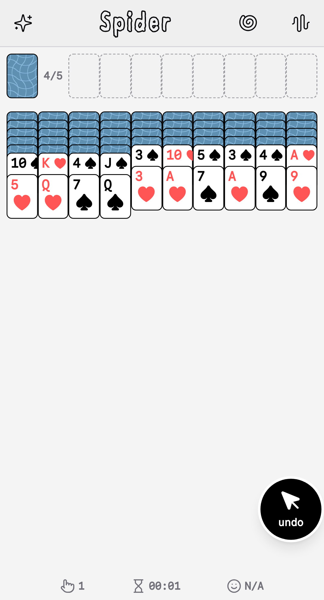

#### Dark mode
 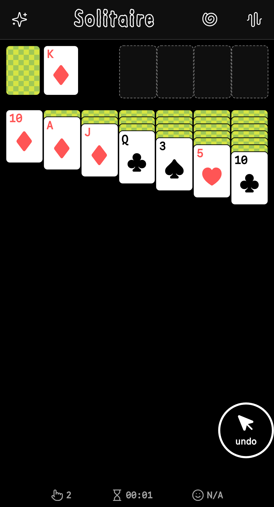
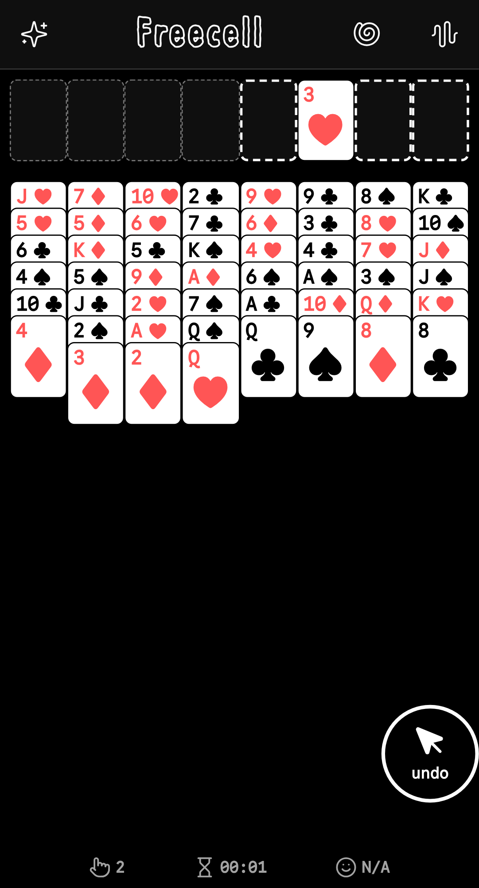
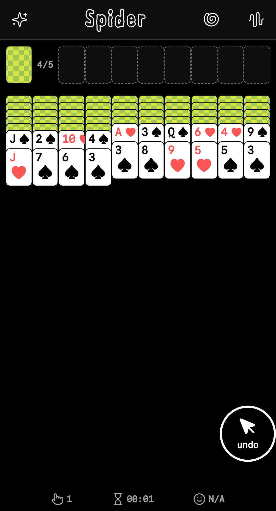

#### Greyscale (optimized for e-ink)
 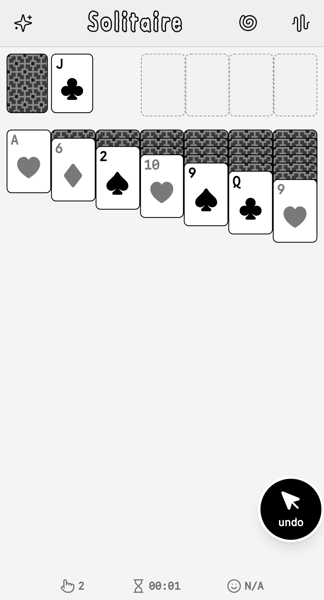
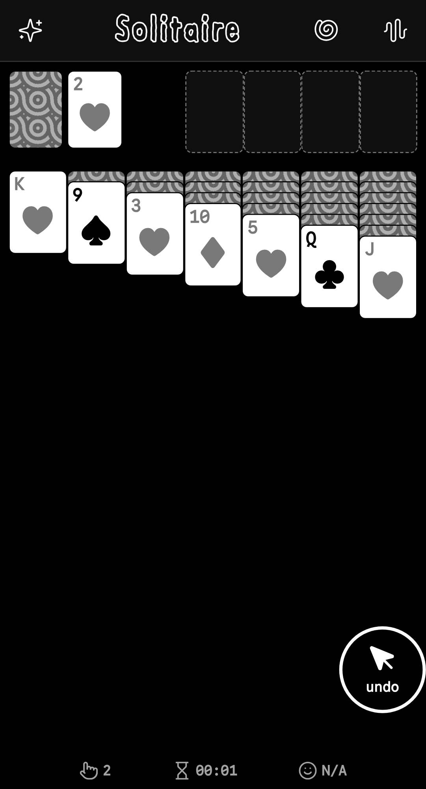
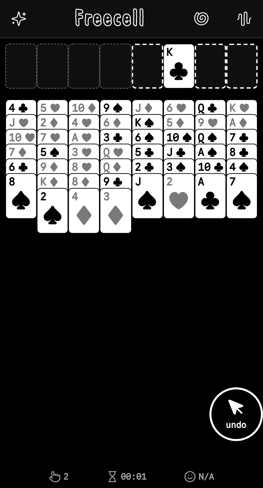

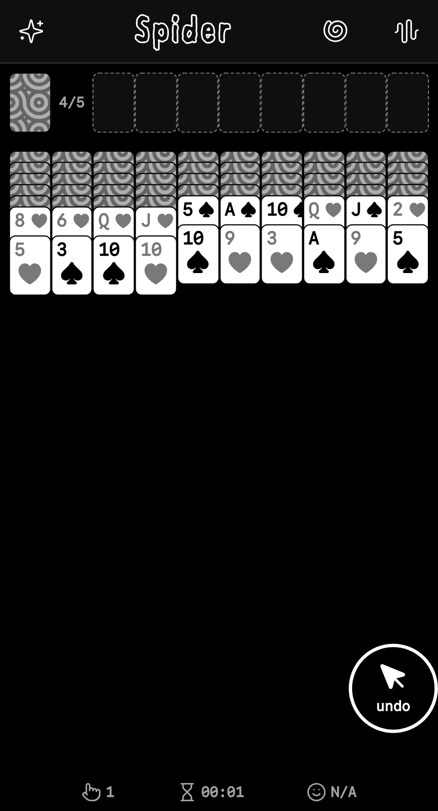

## Future Features
### More card games
- [ ] Three-card draw for Solitaire.
- [X] ~~Freecell~~
- [ ] Spider
  - [ ] 1 suite
  - [ ] 2 suite
  - [ ] 4 suite
- [ ] Pyramid
### Gameplay options
- [X] ~~Implement an extended Undo feature to revert more than 15 moves.~~
- [ ] Implement a "reset" button (doesn't start a new game; restarts the current game)
### View options
- [ ] Add custom card color options in settings.
- [X] ~~Dark mode and light mode~~
- [X] ~~Color mode and greyscale mode~~
### Other
- [X] ~~PWA~~
